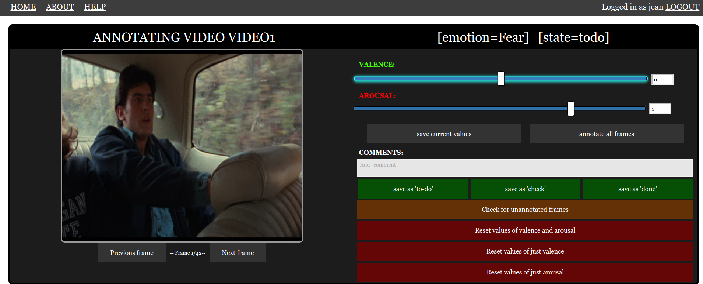

# Online annotation of valence and arousal.
 MongoDB and Flask backed online annotation tool for valence and arousal.

The tool is released **for research purposes only**.

Should you use this tool, please cite:
```
@article{kossaifi_AFEWVA,
    author = {J. Kossaifi and G. Tzimiropoulos and S. Todorovic and M. Pantic},
    journal = {Image and Vision Computing},
    title = {AFEW-VA for valence and arousal estimation in-the-wild, submitted},
    year = {2016},
}
```

For more information about the tool, please check the [wiki](https://github.com/JeanKossaifi/valence_arousal_annotator/wiki).
 
## Screenshot of the online tool:



## Install

### Pre-requisite:
You need MongoDB installed.

### With conda

Clone the repository:
```
git clone https://github.com/JeanKossaifi/affect_annotation
cd affect_annotation
```

Create a virtual environment, activate it and get the requirements:
```
conda create --name annotator python
source activate annotator
pip install -r requirements.txt --user
```

## Running the annotation tool in development mode:

### Initialiasing the database and adding a new user (with admin rights):
```
python manage.py init username password -a 1
```

### Running the app in testing
```
python manage.py runserver
```
This will make the app running on port 55555 at [localhost:55555/login](localhost:55555/login)

### Adding a new user with no administration rights
```
python manage.py new_user username password -a 0
```

### Updating the users data after adding new videos:
```
python manage.py update_data
```

More details on administrating the app in the [wiki](https://github.com/JeanKossaifi/valence_arousal_annotator/wiki/Deploying-the-server).


## Saving the annotated data:

### Saving the whole database using mongo:
To save the db in a file 
``` bash
mongoexport -d annotations -c annotation -o '/data/savefile.json'
```
(here we are saving the collection annotation from the database annotations)

To import back:
``` bash
mongoimport -d annotations -c annotations --file '/data/savefile.json'
```

### Exporting annotations to json files:
```
python manage.py save_annotations /path/to/save/folder annotator_username
```

## Setting up your data for annotation
The repo contains some demonstration data. 
To use yours, create one folder per video in the subfolder:
```
/annotator/static/data
```
Each folder should contain images in png format.

Optionally, you can provide annotations in json format.
If so, in each folder put a file named like the folder and with a json extension.
For more detail check [this wiki page](https://github.com/JeanKossaifi/valence_arousal_annotator/wiki/Setting-up-the-data-to-annotate).


## Deploying in production:
First install tornado:
```
pip install tornado
```

Update the `SECRET_KEY` in `./annotator/__init__.py`:
```python
app.config["SECRET_KEY"] = "your_secret_key"
```

Then use the deploy script (you may want to change the port):
```
python deploy.py
```


## Annotating your data:
When you load the /annotate page, the focus is by default on annotate all frames.
If you click that button you can annotate valence using the up and down keys or the sliders.
The right key saves the current values and goes to the next frame.
When you have annotated all frames for valence, the video is rewinded and you can now annotate arousal with the keys.
You can then save as 'check' if you want to verify your annotations later, 'to-do' if you want to redo it or 'done' if you are confident with the results.

## Questions and contributions:
For more information about the tool, please check the [wiki](https://github.com/JeanKossaifi/valence_arousal_annotator/wiki).

Contributions are welcome, feel free to create a pull-request or open a new issue.
If you have questions you can contact me at jean [dot] kossaifi+annotator [at] gmail [.com]
